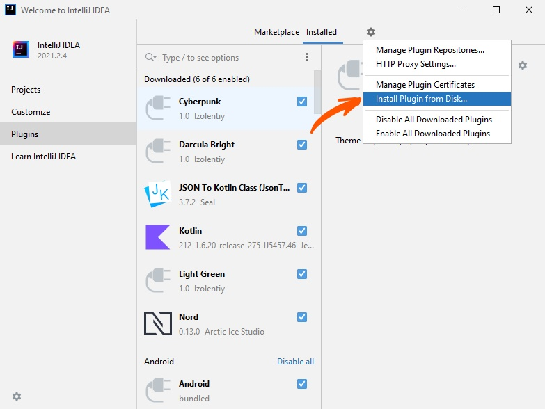
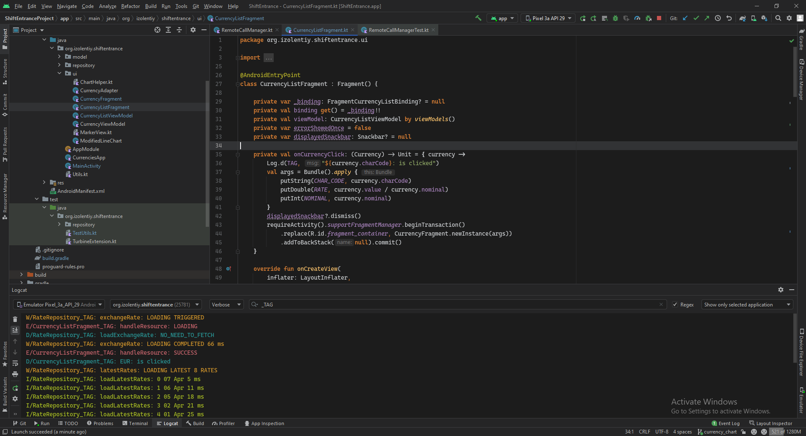
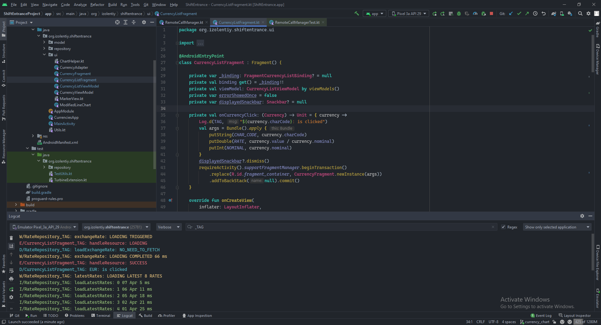
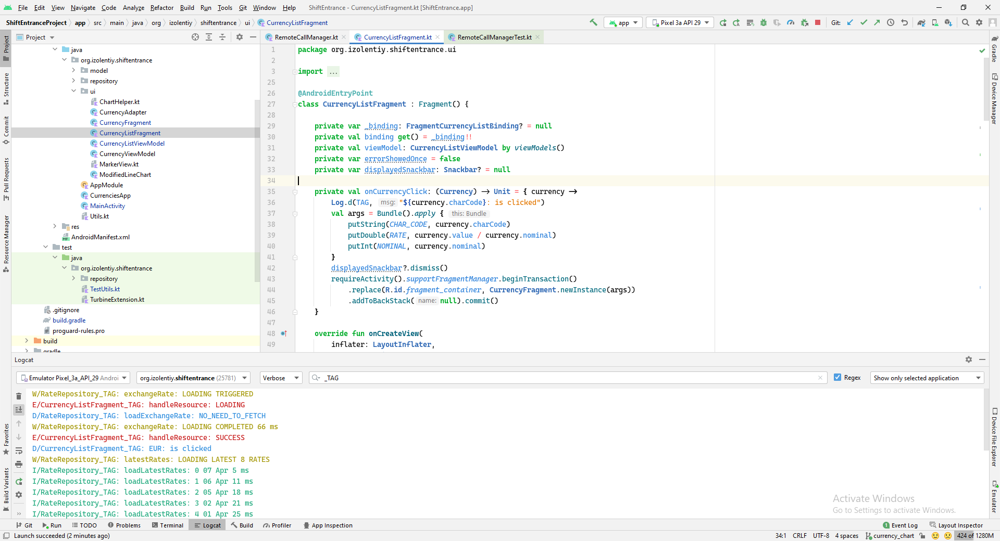

# IntelliJ IDE themes

#### Installation:
1. Open your IntelliJ platform based IDE (Android Studio, IDEA, PyCharm)
2. As shown on picture click "Install plugin from disk" 
3. Choose one of the downloaded .jar files.
4. Voila! You have installed theme.

### Darcula Solid made by [Vecheslav Druzhbin][1], with little changes by me

### Cyberpunk theme inspired by color palette of the known game

### Light Green made by me

[1]:https://github.com/vecheslav
