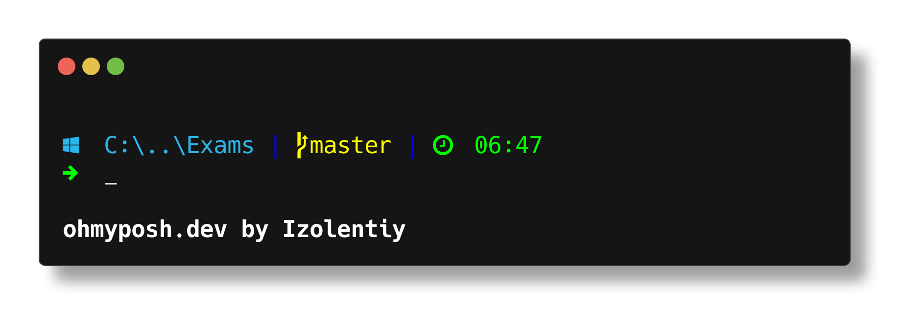

# Windows Terminal themes
#### To install theme you need:
1. Install powershell module "oh-my-posh". [Details here][1]
2. Go to "C:\Users\%USERNAME%\AppData\Local\oh-my-posh\themes" direcotry.
3. Copy the theme you like and paste it inside of this directory
4. Edit powershell profile to make it load your theme every time you launch Windows terminal

### Custom Wopian theme

[1]:https://ohmyposh.dev/docs/windows
